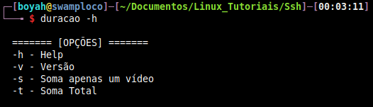

# duracao.sh

### É um programa que soma quantidade horas de vídeos em um diretório específico

- **Instalação**

```
cd ~ && git clone https://github.com/jesherdevsk8/Duracao.git
```

- **Configuração**
   - _Crie um link simbólico para executar o programa em qualquer local da sua distro_

```
sudo ln -s $HOME/scripts/duracao.sh /usr/local/bin/duracao
```

- **Modo de uso**

> _Entre no diretório desejado_
> 


> _Execute duracao -h para abrir o help_
> 


> _Opção **duracao -s** para soma de apenas um vídeo_
> 


> _Opção **duracao -t** para soma total_
> 

